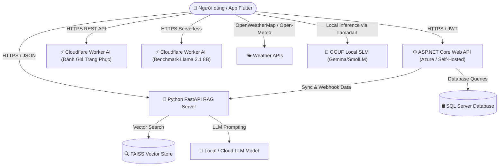

# 👗 OpenSourceTuQuanAoAI — Hệ Thống Quản Lý Tủ Đồ & Gợi Ý Trang Phục Thông Minh (StyleAI Ecosystem)

> **StyleAI** là hệ sinh thái nguồn mở toàn diện kết hợp giữa **Mobile Application (Flutter)**, **Backend Service (.NET 8 Web API)** và **Hệ thống AI/RAG (Python FastAPI + FAISS + Cloudflare Workers AI + SLM/LLM)** nhằm giúp người dùng quản lý tủ đồ cá nhân, theo dõi nhật ký sức khỏe, kết hợp thời tiết thực tế và đề xuất trang phục (outfit) tối ưu theo thời gian thực.

---

## 🎨 Tải Mô Hình AI Cho Đổi Màu Sắc & Giao Diện Động (Dynamic Theme)

Để sử dụng tính năng **tự động thay đổi màu sắc & giao diện động (Dynamic Theme)** dựa trên thể trạng, thời tiết và tâm trạng chạy hoàn toàn **Offline**, bạn có thể tải các file mô hình SLM dạng `.gguf` tại đường dẫn dưới đây:

👉 **[Link Tải Mô Hình AI (.gguf) trên Google Drive](https://drive.google.com/drive/folders/1jWAdrrL-bBF8mO-OS0BMY1Pxm898-Hot)**

### 📥 Hướng dẫn cài đặt mô hình vào ứng dụng:
1. Tải file mô hình (ví dụ: `SmolLM2-360M-Instruct-Q4_K_M.gguf` hoặc `qwen2.5-0.5b-instruct-q4_k_m.gguf`) từ Google Drive ở trên.
2. Đặt file vào thư mục: `tuquanaoAI/assets/models/`
3. Hoặc import trực tiếp từ màn hình **Cài đặt trong ứng dụng** (File được lưu vào thư mục `imported_models/` riêng của thiết bị).

---

## 🔒 Bảo Mật & Quản Lý API Keys / Config Tương Ứng Ở Mỗi Thư Mục

Toàn bộ API Keys, thông tin kết nối Database và Endpoint riêng tư đều được ẩn/tách biệt khỏi mã nguồn và quản lý qua các file cấu hình tương ứng ở từng thư mục:

### 1. 📱 App Flutter (`tuquanaoAI`)
Quản lý tập trung tại tệp: `tuquanaoAI/lib/core/app_config.dart`
```dart
class AppConfig {
  static const String dotnetApiBaseUrl = 'https://YOUR_DOTNET_API_DOMAIN/api';
  static const String ragServerBaseUrl = 'https://YOUR_RAG_SERVER_URL';
  static const String ragApiKey = 'YOUR_RAG_SECRET_KEY';
  static const String outfitEvalWorkerUrl = 'https://YOUR_EVALUATION_WORKER_URL';
  static const String openWeatherMapApiKey = 'YOUR_OPENWEATHERMAP_API_KEY';
}
```

### 2. ⚙️ .NET Web API (`quan_ly_tu_do_API_one`)
Cấu hình mẫu tại `appsettings.Example.json`. Thiết lập riêng tại `quan_ly_tu_do_API_one/quan_ly_tu_do_API/appsettings.json`:
```json
{
  "ConnectionStrings": {
    "DefaultConnection": "Server=YOUR_SERVER;Database=QuanLyTuDoDb;User ID=YOUR_USER;Password=YOUR_PASSWORD;..."
  },
  "Rag": {
    "BaseUrl": "https://YOUR_RAG_SERVER_URL",
    "ApiKey": "YOUR_RAG_SECRET_KEY"
  }
}
```

### 3. 🧠 Python FastAPI RAG Server (`RAG_SERVER_one`)
Cấu hình mẫu tại `.env.example`. Thiết lập riêng tại `RAG_SERVER_one/.env`:
```env
API_BASE_URL=https://YOUR_DOTNET_API_DOMAIN
RAG_API_KEY=YOUR_RAG_SECRET_KEY
LLM_MODEL_PATH=./models/gemma-3-1b-it-bf16.gguf
PORT=8000
```

---

## 🏗️ Kiến Trúc Hệ Thống (System Architecture)

Hệ thống được thiết kế linh hoạt với các luồng trao đổi dữ liệu qua API, Cloudflare Workers AI và Local AI:



### 1. 📱 App Mobile — `tuquanaoAI` (Flutter)
- **Công nghệ:** Flutter SDK, Provider (State Management), `llamadart`, `geolocator`, `shared_preferences`, `http`.
- **Chức năng:**
  - Giao diện quản lý tủ đồ (thêm/sửa/xóa trang phục, phân loại theo loại đồ, mùa, màu sắc).
  - Tự động lấy vị trí và thông tin thời tiết thực tế tại thời điểm sử dụng.
  - Tích hợp theo dõi sức khỏe (nhịp tim, giờ ngủ) để gợi ý trang phục phù hợp với thể trạng.
  - Hỗ trợ cả **AI Offline** (chạy SLM trực tiếp trên điện thoại qua `llamadart`) và **AI Online** (thông qua RAG Server và Cloudflare Workers AI).

### 2. ⚙️ Backend API — `quan_ly_tu_do_API_one` (ASP.NET Core Web API)
- **Công nghệ:** .NET 8 Web API, Entity Framework Core, SQL Server, Swagger/OpenAPI, `RagWebhookService`.
- **Chức năng:**
  - Quản lý tài khoản người dùng, đăng ký/đăng nhập & phân quyền (JWT Authentication).
  - Quản lý danh mục tủ quần áo (`ClothingItems`), danh sách Outfit (`Outfits`), nhật ký sức khỏe (`HealthLogs`) và sở thích người dùng (`UserPreferences`).
  - Đồng bộ dữ liệu real-time tới RAG Server qua Webhook Service khi có thay đổi dữ liệu.

### 3. 🧠 RAG & AI Server — `RAG_SERVER_one` (Python FastAPI)
- **Công nghệ:** Python 3.10+, FastAPI, FAISS Vector Index, SentenceTransformers Embedder, Uvicorn.
- **Chức năng:**
  - **Dịch vụ RAG (Retrieval-Augmented Generation):** Truy vấn vector thông tin tủ đồ, sở thích, thể trạng sức khỏe kết hợp với bộ quy tắc phối đồ tĩnh (`fashion_rules.py`).
  - **Ablation Testing / So sánh dữ liệu:** Cho phép chạy thử nghiệm song song nhiều nguồn dữ liệu (Wardrobe, Preferences, Health, Rules) để đánh giá chất lượng gợi ý.

---

## 🤖 Chi Tiết Tích Hợp AI & Gọi API Trong Mã Nguồn Dart (`tuquanaoAI`)

Ứng dụng Flutter kết hợp linh hoạt giữa **Local AI (Offline)**, **Cloudflare Workers AI**, **RAG Server (FastAPI)** và **Dịch Vụ Bên Ngoài (Weather & .NET API)**:

### 1. 🧠 Chạy AI Offline Đổi Màu Giao Diện (`gemma_theme_service.dart`)
- **Vị trí file:** `tuquanaoAI/lib/service/gemma_theme_service.dart`
- **Công nghệ & Cơ chế:** 
  - Sử dụng thư viện `llamadart` (C++ bindings của `llama.cpp`) chạy trực tiếp file mô hình `.gguf` trên phần cứng điện thoại.
  - Tự động phát hiện (discover) tất cả các file mô hình `.gguf` trong `assets/models/` hoặc từ bộ nhớ máy (`imported_models/`).
  - Xây dựng **Context theo thời gian thực** (`ThemeContext`): giờ trong ngày, nhiệt độ, tình trạng thời tiết, nhịp tim, giờ ngủ, sở thích cá nhân.
  - Sử dụng cú pháp ràng buộc **GBNF (GGML BNF Grammar)** buộc mô hình chỉ xuất ra định dạng JSON chứa 1 trong 10 bảng màu chuẩn (`ocean`, `forest`, `sunset`, `warm_orange`, `dark_blue`, `lavender`, `mint`, `rose`, `golden_morning`, `rainy_evening`).

### 2. ⚡ Đánh Giá Trang Phục Qua Cloudflare Worker AI (`outfit_eval_viewmodel.dart`)
- **Vị trí file:** `tuquanaoAI/lib/viewmodels/outfit_eval_viewmodel.dart`
- **Công nghệ & API:**
  - Thực hiện gọi tới Cloudflare Worker AI qua HTTP POST sử dụng hằng số `AppConfig.outfitEvalWorkerUrl`.
  - **Dữ liệu gửi đi:** Thông tin Áo (`top`), Quần/Váy (`bottom`), Địa điểm (`destination`), Thời tiết (`weather`), và Thể trạng sức khỏe (`health`).
  - **Kết quả trả về:** Nhận nhận xét đánh giá phối đồ, điểm số phù hợp và đưa ra lời khuyên phong cách từ mô hình AI hosted trên Cloudflare Worker.

### 3. ⚡ Benchmark Serverless AI (`cloud_benchmark_service.dart`)
- **Vị trí file:** `tuquanaoAI/lib/evaluation/lib/cloud_benchmark_service.dart`
- **Công nghệ & API:**
  - Kết nối tới Cloudflare Worker AI sử dụng `AppConfig.cloudBenchmarkWorkerUrl` running **Llama 3.1 8B Instruct FP8**.
  - **Mục đích:** Đo lường và so sánh hiệu năng (Latency, Availability, Accuracy) giữa **Cloud Serverless AI** và **Local SLM**.

### 4. ⚡ Hệ Thống RAG Trả Lời Thông Minh (`rag_service.dart`)
- **Vị trí file:** `tuquanaoAI/lib/service/rag_service.dart`
- **Công nghệ & API:**
  - Kết nối tới **Python FastAPI RAG Server** qua `AppConfig.ragServerBaseUrl` và `AppConfig.ragApiKey`.
  - **`suggestOutfit()`**: Gửi yêu cầu gợi ý có tích hợp tìm kiếm Vector từ kho dữ liệu cá nhân hóa (FAISS) kết hợp bộ quy tắc thời trang tĩnh.
  - **Cơ chế Tự Động Phục Hồi (Auto-sync & Retry):** Nếu server phản hồi lỗi `404` (chưa có chỉ mục vector), service sẽ tự động kích hoạt `syncUser()` rồi gửi lại yêu cầu gợi ý.

### 5. 🌤️ Dịch Vụ Thời Tiết Hai Nguồn Dữ Liệu (`Weather_service.dart`)
- **Vị trí file:** `tuquanaoAI/lib/service/Weather_service.dart`
- **Công nghệ & API:**
  - Lấy tọa độ thực tế của người dùng qua thư viện `geolocator`.
  - **Nguồn chính (Primary):** **OpenWeatherMap API** (`api.openweathermap.org`) sử dụng `AppConfig.openWeatherMapApiKey`.
  - **Nguồn dự phòng (Fallback Auto-switch):** Khi OpenWeatherMap lỗi (hết quota `429` hoặc sai key `401`), dịch vụ tự động chuyển sang **Open-Meteo API** (miễn phí, không cần key) kết hợp **OpenStreetMap Nominatim Reverse Geocoding** để giải mã vị trí thành tên thành phố/quận huyện.

### 6. ⚙️ Quản Lý Kết Nối Backend .NET (`api_client.dart`)
- **Vị trí file:** `tuquanaoAI/lib/api/api_client.dart`
- **Công nghệ & API:**
  - Đóng vai trò làm HTTP Client trung tâm kết nối tới **ASP.NET Core 8 Web API** qua `AppConfig.dotnetApiBaseUrl`.
  - Tự động đính kèm mã xác thực **JWT Bearer Token** vào HTTP Headers (`Authorization: Bearer <token>`) lấy từ `SharedPreferences`.

> 📌 *Ghi chú:* File `ai_repository.dart` trong mã nguồn là interface mẫu chưa sử dụng trong luồng thực tế của ứng dụng.

---

## 🌐 Triển Khai Server & Các Dịch Vụ Mở Rộng / Thay Thế (Cloud Deployment & Alternatives)

Dự án **StyleAI** được thiết kế theo kiến trúc **Loose Coupling (Kết nối lỏng lẻo)**. Người dùng/nhà phát triển hoàn toàn có thể tự do **triển khai hoặc thay thế bằng các hạ tầng Cloud / Self-hosted khác** tùy theo nhu cầu:

### 1. Backend Web API (`quan_ly_tu_do_API_one`)
- **Các phương án thay thế:**
  - **Cloud Hosting:** AWS (App Runner, Elastic Beanstalk, ECS), Google Cloud Run, Microsoft Azure, Render, Railway, DigitalOcean App Platform, Heroku.
  - **Self-Hosted / VPS:** Triển khai trên máy chủ riêng (VPS Linux/Windows) sử dụng Docker Container hoặc IIS / Nginx.
  - **Database Alternative:** Có thể chuyển đổi SQL Azure sang **Microsoft SQL Server cục bộ**, **PostgreSQL** (thông qua `Npgsql.EntityFrameworkCore.PostgreSQL`), **MySQL** hoặc **Supabase**.
- **Cách cấu hình lại Endpoint trong App Flutter:**
  Chỉnh sửa `AppConfig.dotnetApiBaseUrl` trong `tuquanaoAI/lib/core/app_config.dart`.

### 2. RAG AI Server (`RAG_SERVER_one`)
- **Các phương án thay thế:**
  - **Cloud Deployment:** Render, Railway, Fly.io, AWS EC2 / ECS, Google Cloud Run (khuyên dùng các instance hỗ trợ RAM tốt cho Embedder model).
  - **Local Subnet / LAN:** Chạy trực tiếp `uvicorn main:app --host 0.0.0.0 --port 8000` trên máy tính nội bộ trong cùng mạng Wi-Fi với điện thoại.
- **Cách cấu hình lại Endpoint trong App Flutter:**
  Chỉnh sửa `AppConfig.ragServerBaseUrl` và `AppConfig.ragApiKey` trong `tuquanaoAI/lib/core/app_config.dart`.

### 3. Cloudflare Worker AI Đánh Giá Trang Phục (`outfit_eval_viewmodel.dart`)
- **Các phương án thay thế:**
  - **Serverless AI Platforms:** OpenAI API (`gpt-4o` / `gpt-4o-mini`), Groq API, Together AI, Replicate, AWS Bedrock.
  - **Self-Hosted / Local LLM:** Dựng API server với Ollama hoặc VLLM trên máy chủ riêng.
- **Cách cấu hình lại Endpoint:**
  Chỉnh sửa `AppConfig.outfitEvalWorkerUrl` trong `tuquanaoAI/lib/core/app_config.dart`.

### 4. Dịch Vụ Thời Tiết (`WeatherService`)
- Mặc định tích hợp tự động chuyển đổi giữa **OpenWeatherMap API** và **Open-Meteo API** (Free). Có thể thay thế bằng **WeatherAPI.com**, **Tomorrow.io** hoặc **AccuWeather**.

---

## ✨ Tính Năng Nổi Bật

- 👕 **Quản Lý Tủ Đồ Số:** Lưu trữ thông minh danh mục áo, quần, váy, giày dép và phụ kiện.
- 🎨 **Giao Diện Động Đổi Màu Theo Thể Trạng (Local AI):** Tự thay đổi màu sắc giao diện theo thời tiết và thể trạng thông qua mô hình SLM nhẹ chạy trực tiếp trên máy.
- 🌤️ **Gợi Ý Theo Thời Tiết & Thể Trạng:** Tự động điều chỉnh phong cách mặc đồ dựa trên nhiệt độ môi trường, chỉ số nhịp tim và chất lượng giấc ngủ.
- ⚡ **Offline First & Hybrid AI:** Vẫn chạy được gợi ý outfit cơ bản ngay cả khi không có kết nối internet nhờ mô hình AI nhẹ tích hợp trực tiếp trên điện thoại.
- 🔍 **RAG Vector Search & AI Outfit Evaluation:** Đánh giá độ phù hợp của trang phục qua Cloudflare Worker AI và gợi ý qua RAG Vector Search.

---

## 📁 Cấu Trúc Dự Án (Repository Structure)

```text
OpenSourceTuQuanAoAI/
├── tuquanaoAI/               # 📱 Ứng dụng Flutter Mobile App
│   ├── lib/
│   │   ├── api/              # ApiClient kết nối .NET 8 Web API
│   │   ├── core/             # AppConfig (Quản lý API Keys/URLs), Theme & Palette
│   │   ├── evaluation/       # CloudBenchmarkService (Cloudflare Workers AI)
│   │   ├── repositories/     # ai_repository.dart (Interface mẫu)
│   │   ├── service/          # GemmaThemeService (Local AI), RagService, WeatherService
│   │   └── viewmodels/       # OutfitEvalViewModel (Cloudflare Worker AI), AuthViewModel, etc.
│   ├── assets/models/        # Chứa file mô hình AI local (.gguf)
│   └── pubspec.yaml          # Quản lý thư viện Flutter
├── quan_ly_tu_do_API_one/    # ⚙️ ASP.NET Core Backend API
│   ├── quan_ly_tu_do_API/    # Controllers, Models, Data (EF Core), appsettings.Example.json
│   └── quan_ly_tu_do_API.sln # Solution file
├── RAG_SERVER_one/           # 🧠 Python FastAPI RAG Server
│   ├── main.py               # Entry point FastAPI Server
│   ├── .env.example          # Mẫu môi trường API Key & Config
│   ├── routers/              # API Endpoints (/api/suggest, /api/sync)
│   ├── services/             # Vector Store (FAISS), Embedder, LLM Service
│   └── requirements.txt      # Thư viện Python
├── LICENSE                   # Giấy phép nguồn mở MIT
└── README.md                 # Hướng dẫn chi tiết dự án
```

---

## 🚀 Hướng Dẫn Cài Đặt & Vận Hành (Getting Started)

### Yêu Cầu Tiền Đề (Prerequisites)
- **Flutter SDK:** `>= 3.10.x`
- **.NET SDK:** `>= 8.0`
- **Python:** `>= 3.10`
- **SQL Server / LocalDB**

---

### 1. Khởi Động Backend API (.NET 8)

1. Di chuyển vào thư mục dự án:
   ```bash
   cd quan_ly_tu_do_API_one/quan_ly_tu_do_API
   ```
2. Tạo tệp `appsettings.json` từ `appsettings.Example.json` và cấu hình kết nối SQL Server & RAG Key:
   ```json
   "ConnectionStrings": {
     "DefaultConnection": "Server=YOUR_SERVER;Database=QuanLyTuDoDb;User ID=YOUR_USER;Password=YOUR_PASSWORD;Trusted_Connection=False;Encrypt=True;TrustServerCertificate=True;"
   }
   ```
3. Cập nhật Database & Khởi chạy server:
   ```bash
   dotnet ef database update
   dotnet run
   ```
   > API Swagger sẽ chạy mặc định tại: `https://localhost:7198/swagger` hoặc `http://localhost:5156/swagger`

---

### 2. Khởi Động RAG AI Server (Python FastAPI)

1. Di chuyển vào thư mục RAG Server:
   ```bash
   cd RAG_SERVER_one
   ```
2. Tạo tệp `.env` từ `.env.example` và thiết lập các biến môi trường bí mật:
   ```env
   API_BASE_URL=http://localhost:5156
   RAG_API_KEY=YOUR_RAG_SECRET_KEY
   ```
3. Tạo môi trường ảo, cài đặt thư viện & Khởi chạy server:
   ```bash
   python -m venv venv
   # Windows:
   .\venv\Scripts\activate
   # Linux/macOS:
   source venv/bin/activate
   pip install -r requirements.txt
   uvicorn main:app --host 0.0.0.0 --port 8000 --reload
   ```
   > Tài liệu API Swagger của RAG Server: `http://localhost:8000/docs`

---

### 3. Khởi Động Ứng Dụng Mobile (Flutter)

1. Di chuyển vào thư mục ứng dụng Flutter:
   ```bash
   cd tuquanaoAI
   ```
2. Cấu hình các API Key và URL Server tại `lib/core/app_config.dart`.
3. Tải các gói phụ thuộc & Chạy app:
   ```bash
   flutter pub get
   flutter run
   ```

---

## 📡 Các API Endpoints Chính (RAG Server)

| HTTP Method | Endpoint | Mô Tả |
|---|---|---|
| `GET` | `/health` | Kiểm tra trạng thái hoạt động của RAG Server & mô hình LLM |
| `POST` | `/api/sync` | Đồng bộ dữ liệu người dùng từ .NET Backend vào FAISS Vector Store |
| `POST` | `/api/suggest` | Tạo gợi ý trang phục RAG dựa trên tủ đồ, sở thích & thời tiết |
| `POST` | `/api/suggest/compare` | So sánh kết quả gợi ý giữa các nhóm dữ liệu khác nhau (Ablation Test) |

---

## 📜 Giấy Phép (License)

Dự án được phân phối dưới giấy phép **MIT License**. Bạn có thể tự do sử dụng, chỉnh sửa và đóng góp cho cộng đồng. Xem chi tiết tại tệp [LICENSE](LICENSE).

---

🤝 **Đóng góp (Contribution):** Mọi ý kiến đóng góp, báo lỗi (Issue) hoặc Pull Request đều được chào đón!