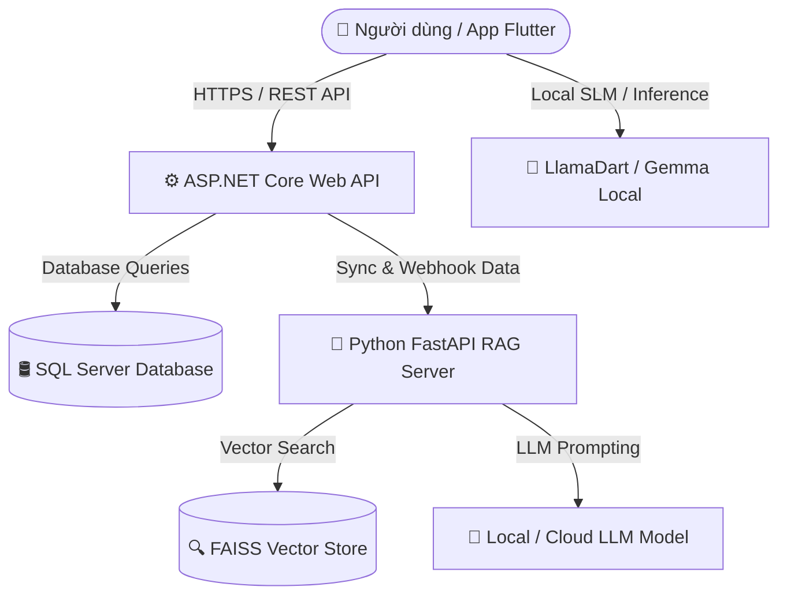

# 👗 OpenSourceTuQuanAoAI — Hệ Thống Quản Lý Tủ Đồ & Gợi Ý Trang Phục Thông Minh (StyleAI Ecosystem)

> **StyleAI** là hệ sinh thái nguồn mở toàn diện kết hợp giữa **Mobile Application (Flutter)**, **Backend Service (.NET 8 Web API)** và **Hệ thống AI/RAG (Python FastAPI + FAISS + SLM/LLM)** nhằm giúp người dùng quản lý tủ đồ cá nhân, theo dõi nhật ký sức khỏe, kết hợp thời tiết thực tế và đề xuất trang phục (outfit) tối ưu theo thời gian thực.

---

## 🏗️ Kiến Trúc Hệ Thống (System Architecture)

Hệ thống được chia thành **3 thành phần độc lập** hoạt động phối hợp với nhau:



### 1. 📱 App Mobile — `tuquanaoAI` (Flutter)
- **Công nghệ:** Flutter SDK, Provider (State Management), `llamadart`, `geolocator`, `shared_preferences`, `http`.
- **Chức năng:**
  - Giao diện quản lý tủ đồ (thêm/sửa/xóa trang phục, phân loại theo loại đồ, mùa, màu sắc).
  - Tự động lấy vị trí và thông tin thời tiết thực tế tại thời điểm sử dụng.
  - Tích hợp theo dõi sức khỏe (nhịp tim, giờ ngủ) để gợi ý trang phục phù hợp với thể trạng.
  - Hỗ trợ cả **AI Offline** (chạy SLM trực tiếp trên điện thoại qua `llamadart`) và **AI Online** (thông qua RAG Server).

### 2. ⚙️ Backend API — `quan_ly_tu_do_API_one` (ASP.NET Core Web API)
- **Công nghệ:** .NET 8 Web API, Entity Framework Core, SQL Server, Swagger/OpenAPI, `RagWebhookService`.
- **Chức năng:**
  - Quản lý tài khoản người dùng, đăng ký/đăng nhập & phân quyền.
  - Quản lý danh mục tủ quần áo (`ClothingItems`), danh sách Outfit (`Outfits`), nhật ký sức khỏe (`HealthLogs`) và sở thích người dùng (`UserPreferences`).
  - Đồng bộ dữ liệu real-time tới RAG Server qua Webhook Service khi có thay đổi dữ liệu.

### 3. 🧠 RAG & AI Server — `RAG_SERVER_one` (Python FastAPI)
- **Công nghệ:** Python 3.10+, FastAPI, FAISS Vector Index, SentenceTransformers Embedder, Uvicorn.
- **Chức năng:**
  - **Dịch vụ RAG (Retrieval-Augmented Generation):** Truy vấn vector thông tin tủ đồ, sở thích, thể trạng sức khỏe kết hợp với bộ quy tắc phối đồ tĩnh (`fashion_rules.py`).
  - **Ablation Testing / So sánh dữ liệu:** Cho phép chạy thử nghiệm song song nhiều nguồn dữ liệu (Wardrobe, Preferences, Health, Rules) để đánh giá chất lượng gợi ý.

---

## ✨ Tính Năng Nổi Bật

- 👕 **Quản Lý Tủ Đồ Số:** Lưu trữ thông minh danh mục áo, quần, váy, giày dép và phụ kiện.
- 🌤️ **Gợi Ý Theo Thời Tiết & Thể Trạng:** Tự động điều chỉnh phong cách mặc đồ dựa trên nhiệt độ môi trường, chỉ số nhịp tim và chất lượng giấc ngủ.
- ⚡ **Offline First & Hybrid AI:** Vẫn chạy được gợi ý outfit cơ bản ngay cả khi không có kết nối internet nhờ mô hình AI nhẹ tích hợp trực tiếp trên điện thoại.
- 🔍 **RAG Thông Minh:** Kết hợp tìm kiếm vector chính xác cao từ tủ đồ thực tế của người dùng thay vì gợi ý chung chung.

---

## 📁 Cấu Trúc Dự Án (Repository Structure)

```text
OpenSourceTuQuanAoAI/
├── tuquanaoAI/               # 📱 Ứng dụng Flutter Mobile App
│   ├── lib/                  # Mã nguồn Dart (Views, ViewModels, Services, Models)
│   ├── assets/               # Hình ảnh, biểu tượng & mô hình AI nhẹ (.gguf)
│   └── pubspec.yaml          # Quản lý thư viện Flutter
├── quan_ly_tu_do_API_one/    # ⚙️ ASP.NET Core Backend API
│   ├── quan_ly_tu_do_API/    # Controllers, Models, Data (EF Core), Services
│   └── quan_ly_tu_do_API.sln # Solution file
├── RAG_SERVER_one/           # 🧠 Python FastAPI RAG Server
│   ├── main.py               # Entry point FastAPI Server
│   ├── routers/              # API Endpoints (/api/suggest, /api/sync)
│   ├── services/             # Vector Store (FAISS), Embedder, LLM Service
│   └── requirements.txt      # Các thư viện Python cần thiết
├── LICENSE                   # Giấy phép nguồn mở MIT
└── README.md                 # Hướng dẫn chi tiết dự án
```

---

## 🚀 Hướng Dẫn Cài Đặt & Vận Hành (Getting Started)

### Yêu Cầu Tiền Đề (Prerequisites)
- **Flutter SDK:** `>= 3.10.x`
- **.NET SDK:** `>= 8.0`
- **Python:** `>= 3.10`
- **SQL Server / LocalDB**

---

### 1. Khởi Động Backend API (.NET 8)

1. Mở terminal và di chuyển vào thư mục dự án:
   ```bash
   cd quan_ly_tu_do_API_one/quan_ly_tu_do_API
   ```
2. Cấu hình chuỗi kết nối SQL Server trong `appsettings.json`:
   ```json
   "ConnectionStrings": {
     "DefaultConnection": "Server=YOUR_SERVER;Database=QuanLyTuDoDb;Trusted_Connection=True;TrustServerCertificate=True;"
   }
   ```
3. Cập nhật Database & Khởi chạy server:
   ```bash
   dotnet ef database update
   dotnet run
   ```
   > API Swagger sẽ chạy mặc định tại: `https://localhost:7198/swagger` hoặc `http://localhost:5156/swagger`

---

### 2. Khởi Động RAG AI Server (Python FastAPI)

1. Mở terminal và di chuyển vào thư mục RAG Server:
   ```bash
   cd RAG_SERVER_one
   ```
2. Tạo và kích hoạt môi trường ảo Python:
   ```bash
   python -m venv venv
   # Trên Windows:
   .\venv\Scripts\activate
   # Trên Linux/macOS:
   source venv/bin/activate
   ```
3. Cài đặt các thư viện cần thiết:
   ```bash
   pip install -r requirements.txt
   ```
4. Khởi chạy FastAPI Server với Uvicorn:
   ```bash
   uvicorn main:app --host 0.0.0.0 --port 8000 --reload
   ```
   > Tài liệu API Swagger của RAG Server: `http://localhost:8000/docs`

---

### 3. Khởi Động Ứng Dụng Mobile (Flutter)

1. Di chuyển vào thư mục ứng dụng Flutter:
   ```bash
   cd tuquanaoAI
   ```
2. Tải các gói phụ thuộc (Dependencies):
   ```bash
   flutter pub get
   ```
3. Kiểm tra thiết bị / trình giả lập kết nối:
   ```bash
   flutter devices
   ```
4. Chạy ứng dụng:
   ```bash
   flutter run
   ```

---

## 📡 Các API Endpoints Chính (RAG Server)

| HTTP Method | Endpoint | Mô Tả |
|---|---|---|
| `GET` | `/health` | Kiểm tra trạng thái hoạt động của RAG Server & mô hình LLM |
| `POST` | `/api/sync` | Đồng bộ dữ liệu người dùng từ .NET Backend vào FAISS Vector Store |
| `POST` | `/api/suggest` | Tạo gợi ý trang phục RAG dựa trên tủ đồ, sở thích & thời tiết |
| `POST` | `/api/suggest/compare` | So sánh kết quả gợi ý giữa các nhóm dữ liệu khác nhau (Ablation Test) |

---

## 📜 Giấy Phép (License)

Dự án được phân phối dưới giấy phép **MIT License**. Bạn có thể tự do sử dụng, chỉnh sửa và đóng góp cho cộng đồng. Xem chi tiết tại tệp [LICENSE](LICENSE).

---

🤝 **Đóng góp (Contribution):** Mọi ý kiến đóng góp, báo lỗi (Issue) hoặc Pull Request đều được chào đón!